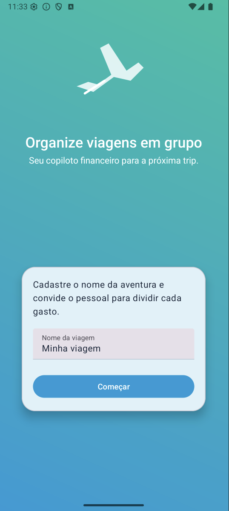
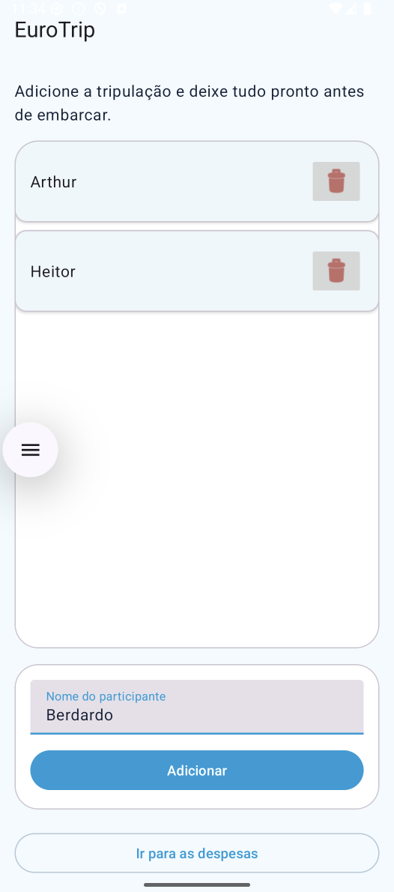
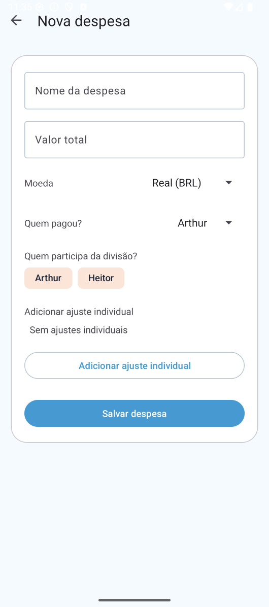
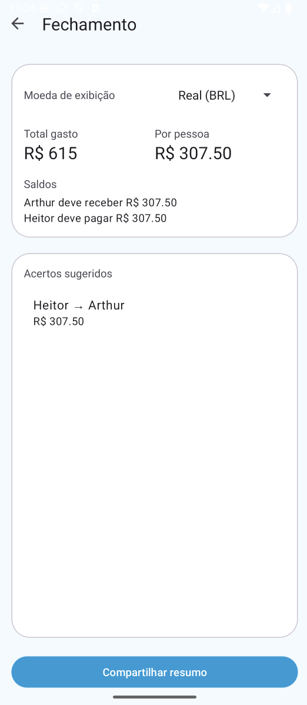

# SplitEasy – AP2 Dev Mobile

Aplicativo Android criado para a Avaliação Parcial 2 da disciplina de Desenvolvimento Mobile. O app ajuda grupos a organizar viagens compartilhando despesas, distribuindo valores entre participantes e sugerindo acertos ao final.

## 📱 Fluxo de Telas
1. **Onboarding:** define o nome da viagem e limpa/recupera o estado salvo.
2. **Participantes:** cadastro e remoção de pessoas com validações e feedbacks.
3. **Lista de Despesas (Activity + Fragment):** hub principal com resumo da moeda e acesso ao fechamento.
4. **Nova/Editar Despesa:** formulário completo com divisão entre participantes, ajustes individuais e múltiplas moedas.
5. **Fechamento:** apresenta totais, saldos personalizados e transferências sugeridas, além de compartilhar o resumo via Intent implícita.

## ✅ Requisitos Atendidos
- 5 telas distintas + 1 `Fragment` funcional (`ExpensesListFragment`).
- Navegação explícita entre telas e Intents implícitas para abrir site, enviar e-mail e compartilhar o fechamento.
- Mais de cinco componentes de UI (ImageView, TextInputLayout/EditText, Button, Spinner, ChipGroup, RecyclerView, FAB etc.) com feedback visual e toasts.
- Persistência local via `SharedPreferences`, garantindo que viagem, participantes e despesas permaneçam após fechar o app.
- Resultado personalizado: o `ExpenseCalculator` processa todas as respostas e gera análise final com saldos e transferências.

## 🛠️ Stack Principal
- Kotlin + Android Studio (Hedgehog ou superior)
- Material Design 3
- ViewBinding
- RecyclerView / AdapterList
- `SharedPreferences` + JSON para persistência simples

## ▶️ Como Executar
1. **Clonar o repositório**
   ```bash
   git clone https://github.com/<seu-usuario>/split-easy-ap2.git
   cd split-easy-ap2
   ```
2. **Abrir no Android Studio**
   - File ▸ Open ▸ selecione a pasta do projeto.
   - Aguarde o *Gradle Sync* concluir.
3. **Rodar em um dispositivo/emulador**
   - Escolha um dispositivo com **Android 7.0 (API 24)** ou superior.
   - Clique em “Run” ou execute `./gradlew assembleDebug`.

> Caso esteja usando apenas a CLI, certifique-se de ter o Java 11 instalado para o Gradle Wrapper.

## 🧭 Como Usar
1. Na tela inicial informe o nome da viagem e toque em **“Começar”**.
2. Cadastre pelo menos duas pessoas (com validação de duplicados) e avance para as despesas.
3. Adicione despesas:
   - Escolha moeda, pagador e participantes.
   - Opcional: crie ajustes individuais (com notas e moedas distintas).
   - É possível editar ou excluir despesas diretamente na lista.
4. Acompanhe o fechamento para ver totais, valores por pessoa e transferências sugeridas.
5. Compartilhe o resumo via Intent implícita com qualquer app de mensagens/e-mail.

## 📸 Prints do App
Adicione seus prints na pasta `docs/screens/` e ajuste os arquivos conforme necessário.

| Tela | Preview |
| --- | --- |
| Onboarding |  |
| Participantes |  |
| Lista de despesas |  |
| Formulário de despesa |  |
| Fechamento |  |

> Sugestão: capture prints diretamente do emulador/dispositivo (Shift + Cmd + S no Android Studio) e salve com os nomes indicados.

## 🔄 Próximos Passos
- Implementar filtros/categorias para despesas.
- Permitir exportar o fechamento em PDF/CSV.
- Adicionar testes instrumentados para cenários críticos do cálculo.

---
Com isso, o repositório já atende ao requisito de documentação pedida pelo professor: título, descrição, instruções de execução e prints do app. Bons estudos! ✈️
